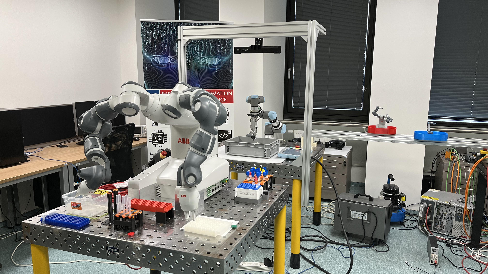

<p align="center">
  
</p>

***

# Robo Medicinae I
<a href="https://github.com/Steigner/Robo_Medicinae_I/blob/main/LICENSE"></a>

https://img.shields.io/github/license/{username}/{repo-name}.svg

**Open-source, copy and modify what you need!**

**Open-source, kopírujte a upravujte co potřebujete!**

<p align="center"><b><h2>Master's Thesis</h2></b></p>
<p align="center"><b>Design and implementation of the robotic platform for an experimental laboratory task</b></p>

<p align="justify"> <b>Abstract:</b> Advanced robotics does not always have to be associated with Industry 4.0, but can also be applied, for example, in the Smart Hospital concept. Developments in this field have been driven by the coronavirus disease (COVID-19), and any improvement in the work of medical staff is welcome. In this thesis, an experimental robotic platform was designed and implemented whose main function is the swabbing samples of the nasal vestibule. The robotic platform represents a complete integration of software and hardware, where the operator has access to a web-based application and can control a number of functions. The increased safety and collaborative approach cannot be overlooked. The result of this work is a functional prototype of the robotic platform that can be further extended, for example, by using alternative technologies, extending patient safety, or clinical testing and studies.</p>

<p align="justify"> <b>Keywords:</b> Robotic platform, smart hospital, nasal vestibule swab, advanced robotics, collaborative robotics, machine vision, convolution neural networks, point cloud, Universal Robots UR3, Intel RealSense D435i, ROS, Flask, Robo Medicinae I </p>

<p align="justify"> <b>Introduction:</b> The influx of COVID-19 has caused mortality and often painful diseases around the world. Intensive research and development to combat this disease is extending to all possible areas, including robotics. In this struggle, robotics plays the role of assistant to the medical staff. Therefore, this thesis also focuses on an experimental laboratory task in the medical field using a collaborative robotic arm and camera system. The aim is to create an advanced robotic platform with the main objective of collecting samples from the nasal vestibule. To solve this task, a UR3 collaborative robot from Universal Robots was used with a customized gripper design consisting of an Onrobot RG2 gripper and a HEX-E sensor, and last but not least, an Intel RealSense D435i 3D camera. The entire solution is then integrated into the software infrastructure, which is mainly powered by Python Flask and the Robotic Operating System. Artificial intelligence, more specifically convolutional neural networks, was also used in this thesis. Primarily to detect the centre of the nostrils.</p>

**Robo Medicinae I - Repositories**:
This work is divided into four main repositories. Each represents a single part. The main repositories for running and executing the simulation or real world execution are **ROS** and **Server**. The **Gripper** and **SegCNN** repositories are only partial parts in the solution.

+ [<=](https://github.com/Steigner/RM1_server) RM1 - Server
+ [<=](https://github.com/Steigner/RM1_ROS) RM1 - ROS         
+ [<=](https://github.com/Steigner/RM1_Gripper) RM1 - Gripper
+ [<=](https://github.com/Steigner/RM1_SegCNN) RM1 - SegCNN

## About
The repository contains **Adobe Ilustrator** graphical designe of HMI and vector graphic of UR3 from Kateřina Monsportová. ZIP Latex source archive and PDF Masters Thesis also included. Last but not least foto documentation.

## Images
<p align="center"><b>Rendered process motion of collecting samples from nasal vestibule</b></p>


<table>
  <tr>
    <td></td>
    <td></td>
  </tr>
  <tr>
    <td></td>
    <td></td>
  </tr>
  <tr>
    <td></td>
    <td></td>
  </tr>
  <tr>
    <td></td>
    <td></td>
  </tr>
</table>

## Video

## Citation
If you want to quote, please quote as Master's Thesis.

**Note:** Please read the whole file before copying the quote, there are additional tags for the full quote.

JUŘÍČEK, Martin.  _Design and implementation of the robotic platform for an experimental laboratory task._ [online]. Brno, 2022. Available at: https://www.vutbr.cz/studenti/zav-prace/detail/138561. Master’s Thesis. Brno University of Technology, Faculty of Mechanical Engineering, Institute of Automation and Computer Science. Supervised by Ing. Roman Parák

```BibTeX
@mastersthesis{juricek,
    author = {Martin JUŘÍČEK},
    title = {Design and implementation of the robotic platform for an experimental laboratory task},
    school = {Brno University of Technology, Faculty of Mechanical Engineering, Institute of Automation and Computer Science.},
    location = {Brno, CZ},
    language = {english},
    year = {2022},
    url = {https://www.vutbr.cz/studenti/zav-prace/detail/138561},
    cited = {202X-XX-XX},
}
```

## Authors

* Author: Martin Juricek
* Designer: Katerina Monsportova
* Supervisor: Roman Parak

This work was created in collaboration with Institute of Automation and Computer Science, Cybernetics and Robotics Division.



## Contact

* Author: 200543@vutbr.cz
* Supervisor: Roman.Parak@vutbr.cz
* Institute: uai@fme.vutbr.cz

## References

[Faculty of Mechanical Engineering BUT](https://www.fme.vutbr.cz/en)

***

<p align="center"></p>
